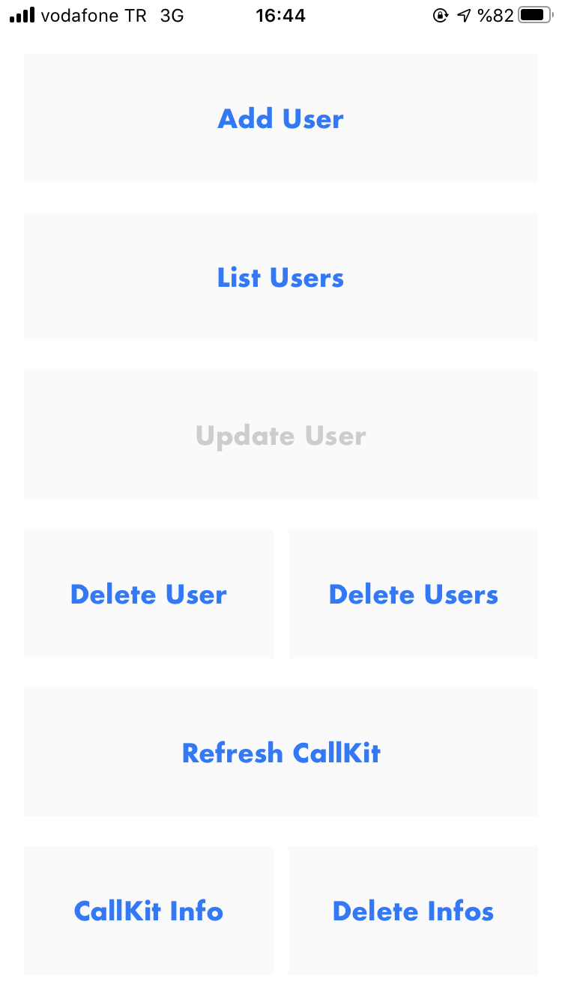
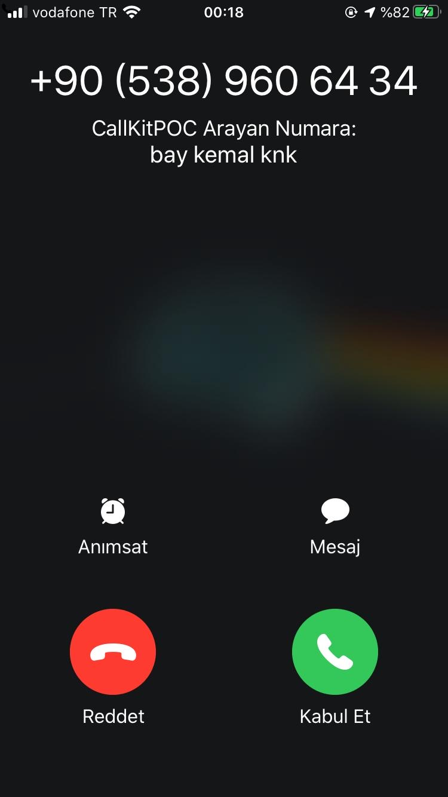

# Callkit Demo

This application was made for learning and testing of Callkit capabilities.

## Getting Started

### Prerequisites
- Xcode 11
- iOS device running iOS 13 (includes cellular)

### Quickstart
1. Clone the repository and open the project in XCode
2. Launch your application to your iOS device
3. Give permission to number identification [(Settings -> Phone -> Call Blocking & Identification)](https://support.apple.com/tr-tr/HT207099)

### Screenshots

Application Interface      |  When Call Arrives
:-------------------------:|:-------------------------:
  |  

## Resources
- Link raywenderlich.com tutorial[CallKit Tutorial for iOS](https://www.raywenderlich.com/1276414-callkit-tutorial-for-ios)
- Link Apple information [CallKit](https://developer.apple.com/documentation/callkit) and [CallDirectoryProvider](https://developer.apple.com/documentation/callkit/cxcalldirectoryprovider)
- Link another tutorial from Pusher [Part 1](https://pusher.com/tutorials/callkit-ios-part-1) and [Part 2](https://pusher.com/tutorials/callkit-ios-part-2)